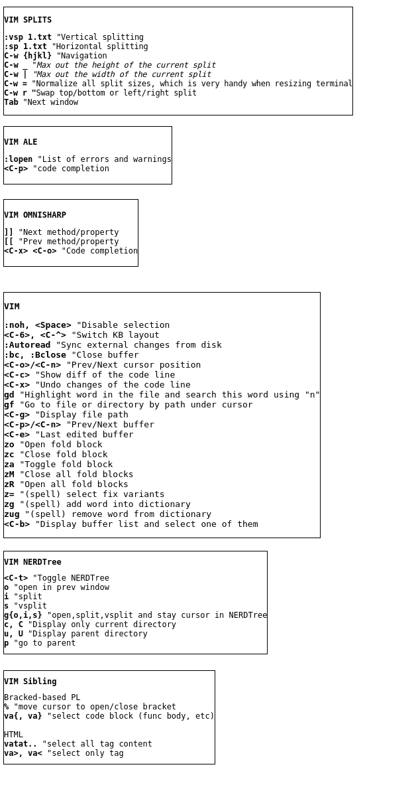

# My dotfiles

- vim
- tmux
- git
- top
- xterm

## VIM



## Backup

Create file `~/.backup-borg-secrets`

```bash
export BORG_PASSPHRASE='blablabla'
```

Create file `/etc/cron.d/backup-borg`

```cron
10 9 * * * root /usr/bin/caffeinate -s /usr/bin/nice -n19 /usr/bin/ionice -c2 -n7 bash -l -c 'cd /home/vit/; source ./.backup-borg-secrets; ./backup-borg.sh >> backup-borg.log'
```
